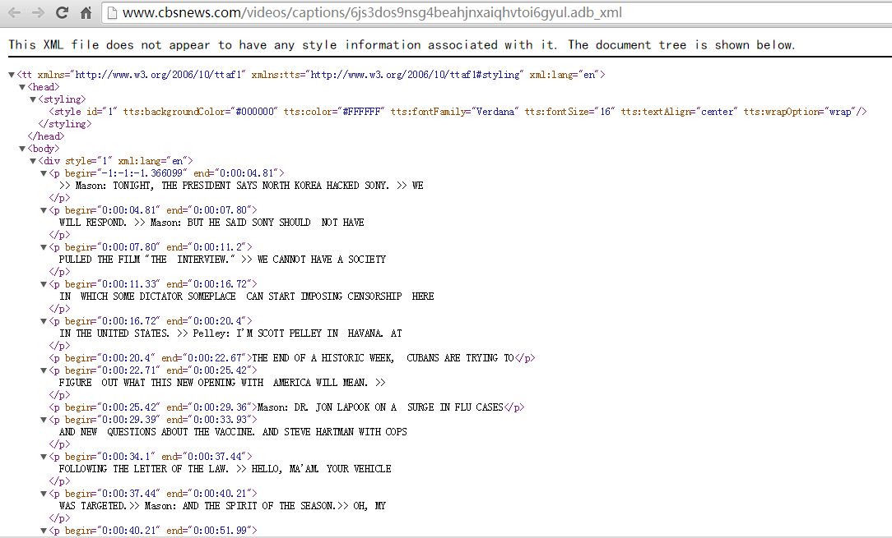
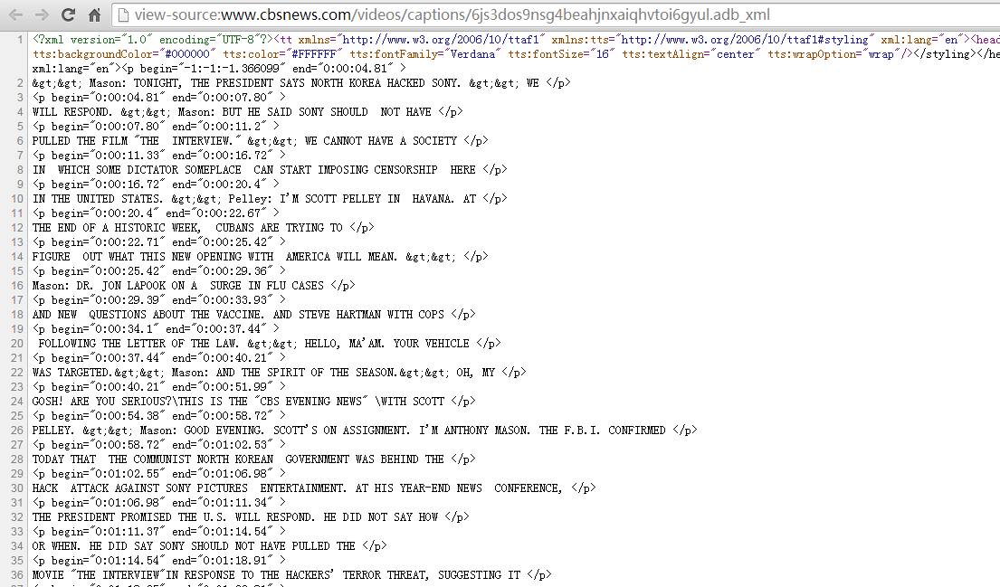
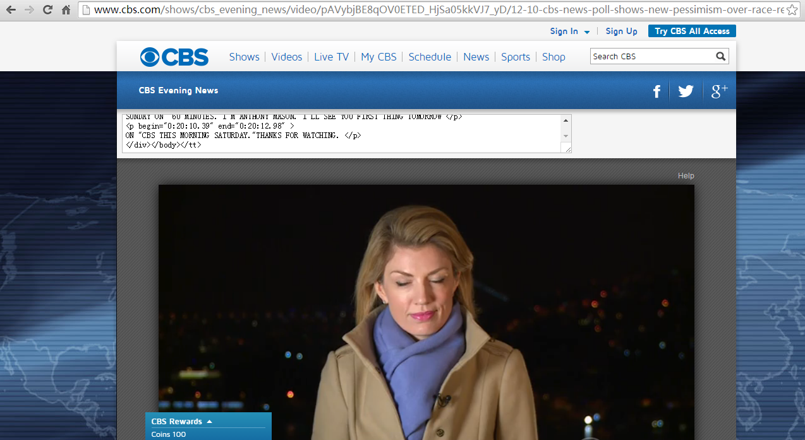

### 本程序用于下载 CBS 字幕

 
#### 需要安装的软件:
1. Chrome 浏览器  
2. Tampermonkey 插件  
3. https://greasyfork.org/zh-CN/scripts/7143-cbs-news-subtitle-download  
 

 
#### 举个例子：

假设你来到了这个页面:  

第一步: Ctrl+U 打开源代码，或者是用其他方式打开源代码  

第二步: 把所有源代码黏贴到这个文本框里，点击一下其他任意的空白地方，字幕就会下载了  
      
浏览任意 CBS 全集视频都会载入这个文本框     
比如：   
http://www.cbs.com/shows/cbs_evening_news/video/pAVybjBE8qOV0ETED_HjSa05kkVJ7_yD/12-10-cbs-news-poll-shows-new-pessimism-over-race-relations-students-offer-hope-for-america-s-racial-divide/