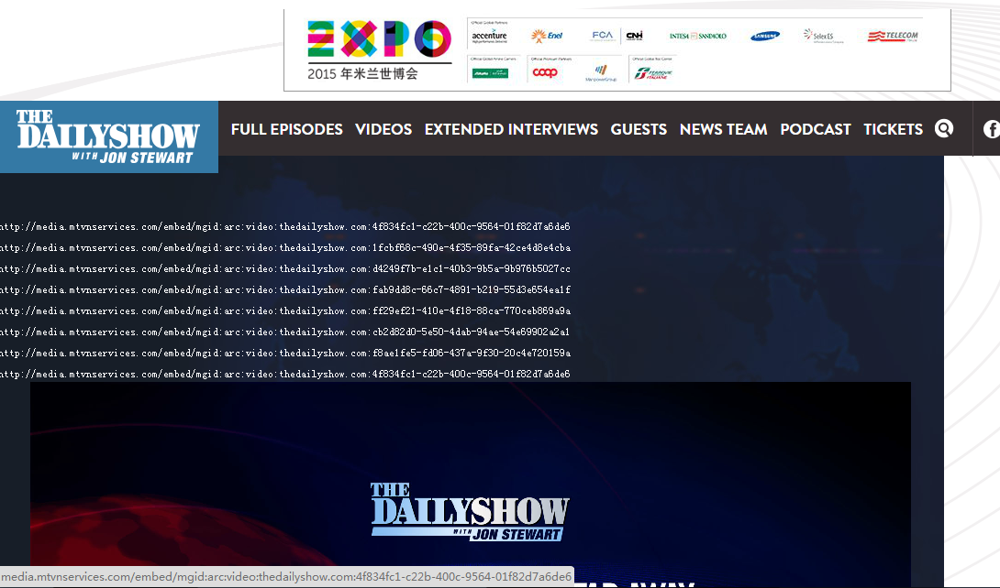
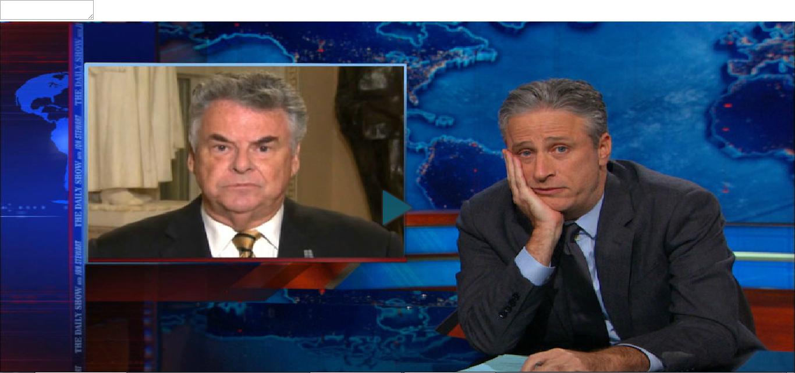
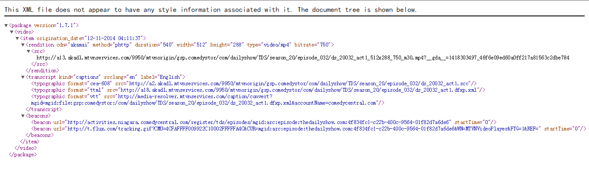
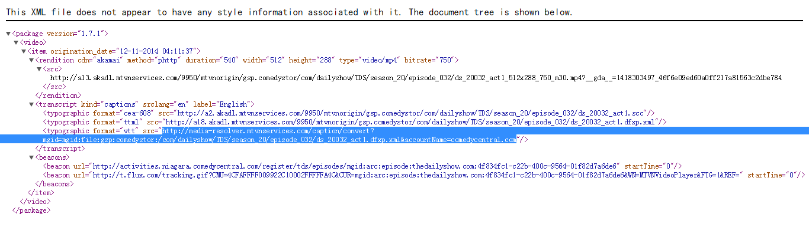
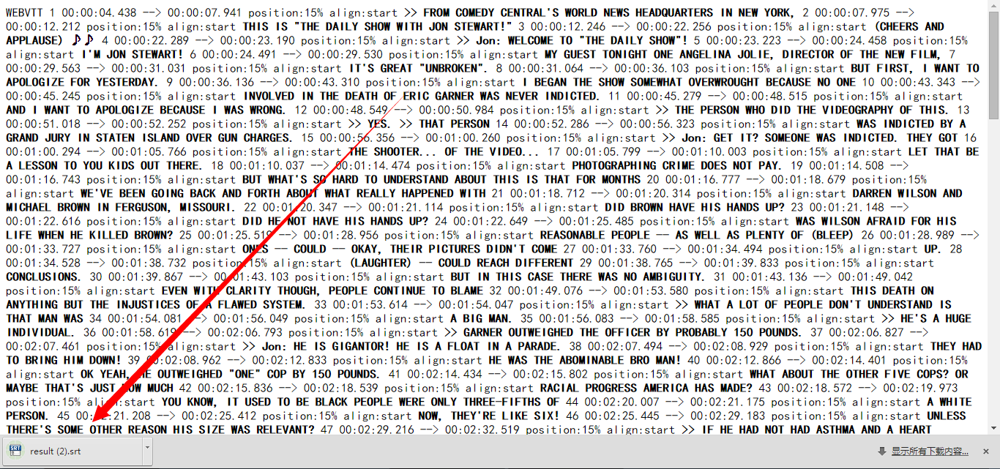

### 本程序用于下载 dailyshow 的中文字幕

首先感谢 [@jarod的外语世界](http://weibo.com/generalistjarod)  
因为下面的程序都是基于 Jarod 对 Daily Show 字幕下载做的研究.  

下面是栗子:

### 第一步
1. 安装 Chrome 浏览器   
2. 安装 Tampermonkey   
3. 进入并安装:  https://greasyfork.org/zh-CN/scripts/6921-for-first-page-full-episode  
4. 进入并安装:  https://greasyfork.org/zh-CN/scripts/6922-for-second-page-flash-copy-embed  
5. 进入并安装:  https://greasyfork.org/zh-CN/scripts/6923-for-third-page-vtt  

打开下面的网址:  
http://thedailyshow.cc.com/full-episodes/ap0zk6/december-4--2014---angelina-jolie  

 
### 第二步
我们拿第一个链接举例，点击进入之后：    
  

点击播放之后, 点击embed,   
    

把东西粘贴到左上角的框里，然后点击下旁边的空白部分，页面会自动跳转到: 
   
   

复制 vtt 这部分
    

访问该页面后, 字幕会自动下载成 result.srt    
      
