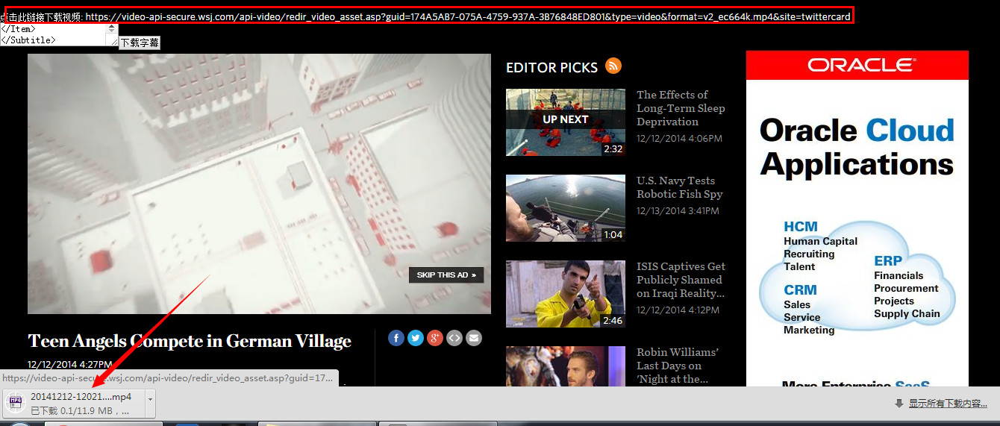
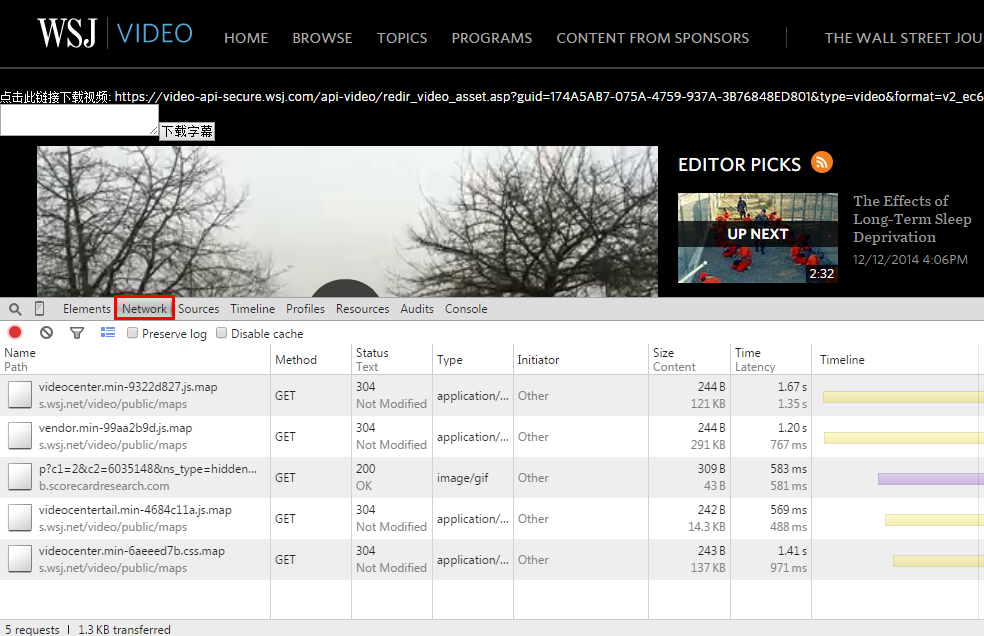
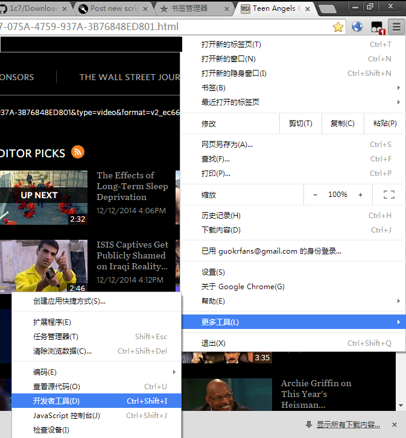
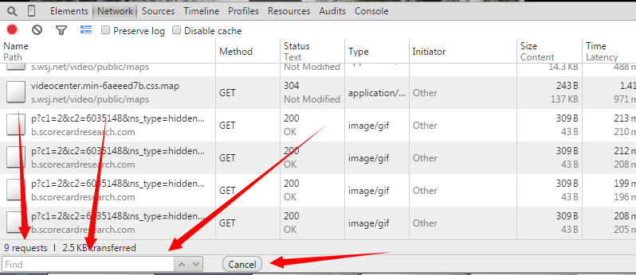
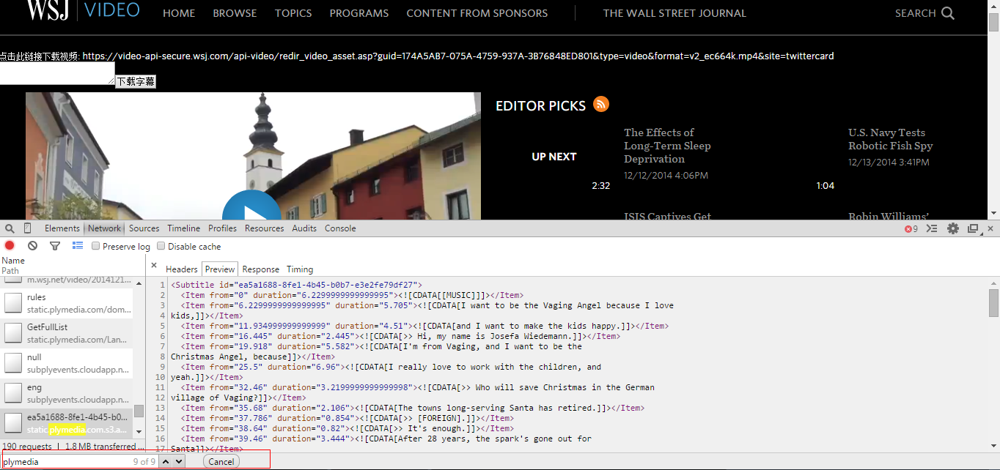
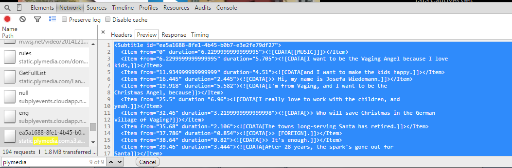
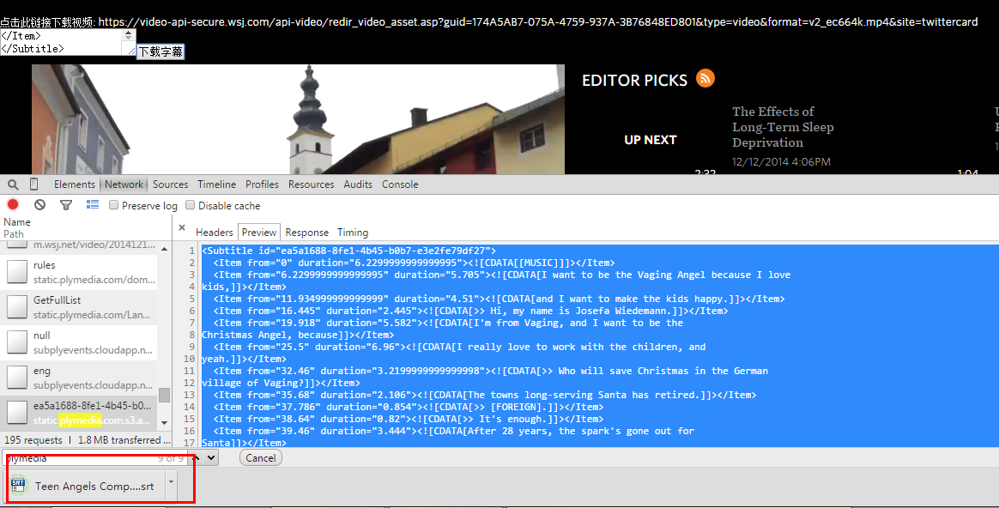

### 本程序用于下载 华尔街日报 的视频和字幕(如下图)  
   
上图的链接: http://www.wsj.com/video/teen-angels-compete-in-german-village/174A5AB7-075A-4759-937A-3B76848ED801.html  
注: 会先播放一个大概30秒的广告，耐心等待放完，或者点击跳过就可以看到视频了.  
注: 并不是所有视频都有字幕.  

 
### 前期准备:
1. 使用 Chrome 浏览器
2. 安装 Tampermonkey 插件
3. 安装程序(点进去之后会有一个绿色的安装按钮): https://greasyfork.org/zh-CN/scripts/6990-download-wsj-video-subtitle   
4. 做完前3步后，界面看起来会是这样的:   
  
 

### 下载视频例子:
直接点击左上角红框内的白色链接就行了   
   

### 下载字幕例子:
首先按 F12 调出开发者工具，然后选择 Network 标签页.  
  

如果 F12 打不开就手动打开, 方法如下图:
  

现在控制台我们打开了, 也调到 Network 标签页了. 
下一步是刷新一下页面.  
现在我们按 Ctrl + F 调出搜索框:  
  

搜索plymedia, 按多几下回车, 跳到第9个搜索结果:  
  

点击一下右边的文本, 然后 Ctrl + A 全选所有内容, Ctrl + C 复制:  
    

Ctrl + V 把内容粘贴到左上角的文本框里:    
    

点击下载字幕按钮:  
    
 